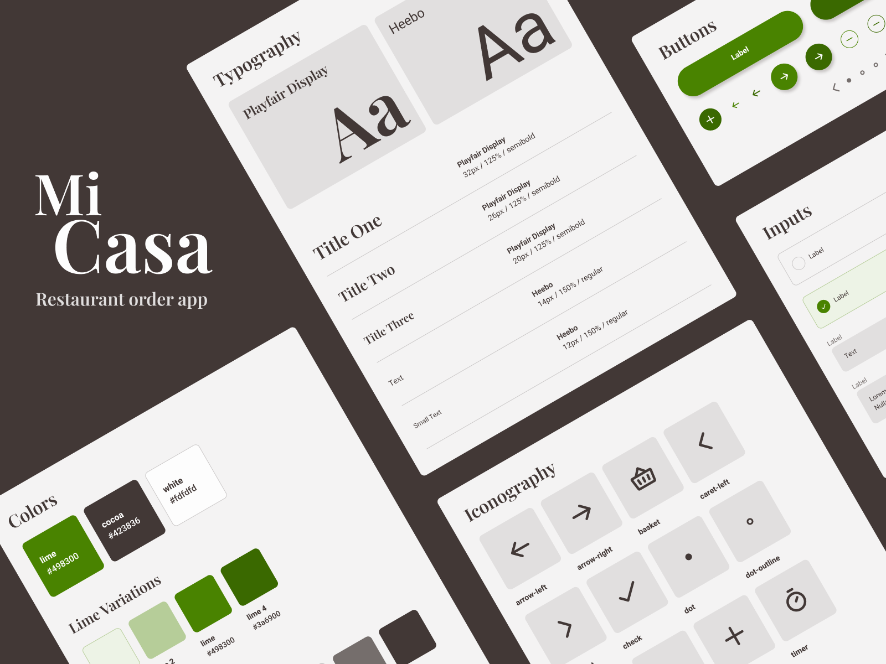

# Design system - Mi Casa

Design system for a restaurant order app using HTML + SCSS.


## Initial install

Run the following in the project directory:

```bash
  npm install
```

Note: This project was created with node 18.16.0 and npm 9.5.1.


## Start development server

```bash
  npm start
```
