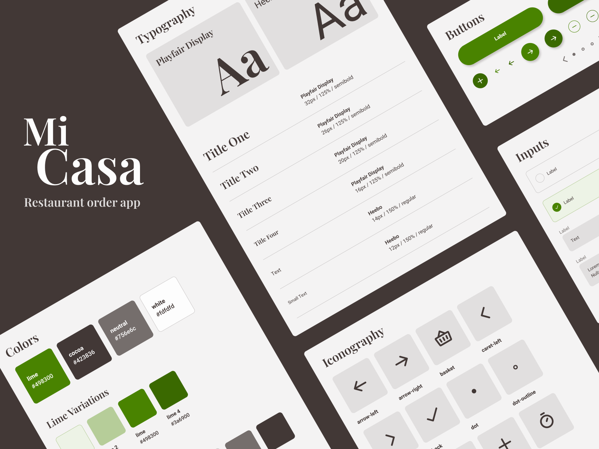

# Design system - Mi Casa

Design system for a restaurant order app using HTML + SCSS.


## Development

### 1. Initial install

Run the following in the project directory:

```bash
  npm install
```

Note: This project was created with node 18.16.0 and npm 9.5.1.


### 2. Run development server

```bash
  npm start
```

## View demo

- <a href="https://mi-casa-design.netlify.app" target="_blank">mi-casa-design.netlify.app</a>
